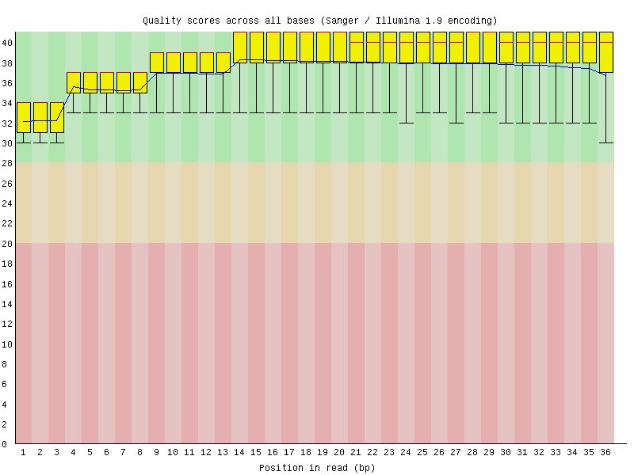

# hse_hw2_chip

[Ссылка на colab](https://colab.research.google.com/drive/1MgXaGtWAcFOYmAl1oYZ7K5A0vaT5UaUb).

[Ссылка на encodeproject моего образца](https://www.encodeproject.org/experiments/ENCSR859FGW/).

Для простоты я кодировал файлы последними тремя буквами.

## Fastqc

Все отчеты в [папке fastqc](./fastqc). Я заметил, что качество исходных fastq файлов уже достаточно хорошее, но на всякий случай решил обрезать их с помощью trimmomatic. Вот графики per base sequence quality:

### ATH
#### original

#### trimmed

### OLG
#### original

#### trimmed

### AYR
#### original

#### trimmed

Также я заметил, что на всех графиках GC есть пик справа на колоколе. Для примера приведу ATH.

## Таблица статистик

|| ATH | OLG | AYR |
| --- | ---- | ---- | ---- |
| число ридов | 35183691 | 27580907 | 34229117 |
| выровнялось уникальных | 1463872 (4.16%) | 1165298 (4.23%) | 1510676 (4.41%) |
| выровнялось неуникальных | 3887668 (11.05%) | 3151620 (11.43%) | 4575912 (13.37%) |
| не выровнялось | 29832151 (84.79%) | 23263989 (84.35%) | 28142529 (82.22%) |

Видимо, процент выравниваний мал, потому что мы выравниваем только на одну хромосому. Еще получилось много неуникальных выравниваний, но это я объяснить не смог.

## Пики

Пиков в ENCODE на порядок больше. Скорее всего это, опять же, из-за того, что мы выравниваем на одну хромосому. Однако, у нас получилось некоторое число пиков, которых нет в ENCODE. Скорее всего, это из-за того, что мы более детально работали с одной хромосомой, но это скорее спекуляция. Уникальных для нас пиков больше чем пересечений между нами и ENCODE, из чего следует, что это существенная часть, а не просто случайные ошибки.
